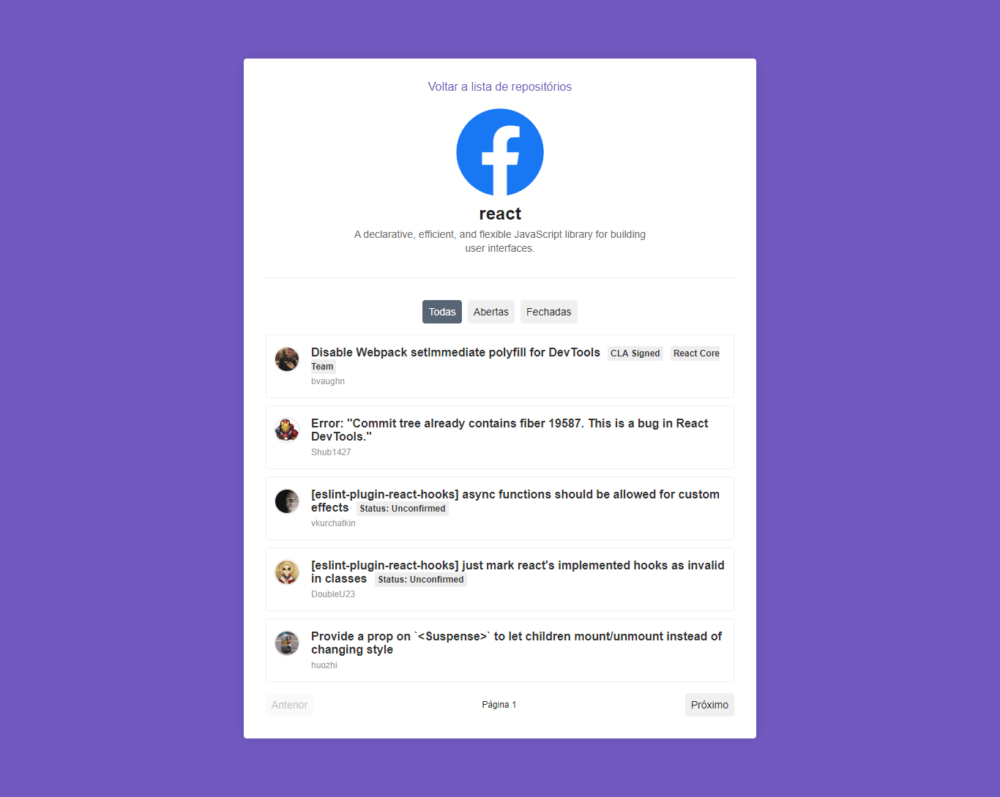

<h1 align="center">
	Issue from Github App
</h1>

 

  

<h4 align="center">
  Guilherme Fünkler Borelli
</h4>

  <a href="#wrench-tecnologias">Tecnologias</a>&nbsp;&nbsp;&nbsp;|&nbsp;&nbsp;&nbsp;
  <a href="#-projeto">Projeto</a>&nbsp;&nbsp;&nbsp;|&nbsp;&nbsp;&nbsp;
  <a href="#-instruções">Instruções</a>

## :wrench: Tecnologias

Esse projeto foi desenvolvido com as seguintes tecnologias:

- [React](https://reactjs.org)
- Diversas bibliotecas como Styled Components, React Icons, Create-React-App, etc

## 💻 Projeto

O projeto que visa melhorar o controle de issues dos repositórios do github.

## 📚 Instruções

Para rodar a aplicação utilizar o comando 'yarn' no diretório 'frontend', após concluída a instalação dos pacotes, utilizar os comandos 'yarn start' no diretório 'frontend', a aplicação iniciará automaticamente.